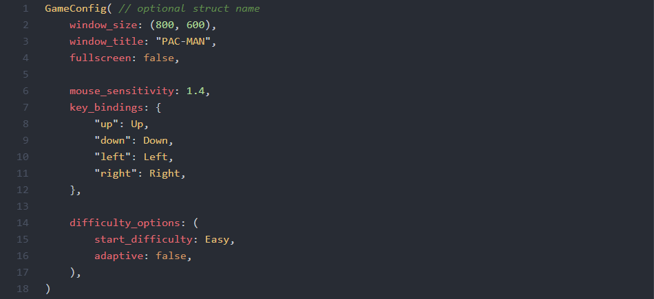

# RON language support in Atom

Adds syntax highlighting and snippets to RON files in Atom.

## What is RON?

[Rusty Object Notation](https://github.com/ron-rs/ron) (RON) is a simple
readable data serialization format that looks similar to Rust syntax,
designed to support all of Serde's data model. Check out the RON repository
for more information!

## Highlighting Example

